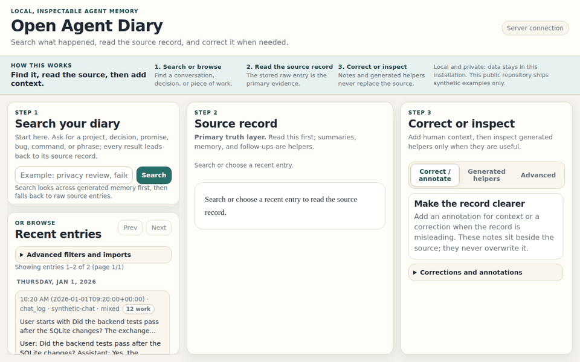

# Open Agent Diary

**Your AI agent talks to you every day. Does it remember what it learned?**

Open Agent Diary is a local-first, inspectable memory and work-trace store for human/agent collaboration. It gives your AI agent durable recall across sessions — and **gives you** the transparency to see exactly what it remembers, where that memory came from, and correct it when it's wrong.



The app is built around a simple loop:

1. **Search or browse** for something your agent worked on.
2. **Read the source record** — the actual conversation, not a summary.
3. **Correct or inspect** the generated layers (memory, summaries, follow-ups) that your agent relies on.

The core rule: **generated memory is never the hidden source of truth.** Everything an agent knows can be traced back to a raw entry you can inspect.

## Who is this for?

- **Hermes / Claude Code / AI agent users** who want persistent recall across sessions
- **Developers** who want transparent, explainable agent memory — not a black box
- **Anyone** who's tired of their assistant forgetting things between conversations

## Quick start

```bash
python3 -m venv .venv
. .venv/bin/activate
pip install -e .
agent-diary serve --host 127.0.0.1 --port 8041
```

On Debian/Ubuntu, install `python3-venv` first if `python3 -m venv` says `ensurepip` is unavailable.

Then open:

```text
http://127.0.0.1:8041
```

## Try it with synthetic sample data

The repository ships with invented demo data only. Import it after starting your virtualenv:

```bash
agent-diary import-session-jsonl --path examples/synthetic-session-import.jsonl --import-id demo
agent-diary produce-conversation-briefs --import-id demo --force
agent-diary produce-compressed-memory --import-id demo --force
agent-diary produce-open-loops --import-id demo
agent-diary search-memory --query "release checklist" --json
agent-diary doctor --json
```

## What is included

- **Browser UI** — search, browse, read, and annotate entries
- **CLI tools** — import sessions, produce memory artifacts, consistency checks
- **REST API** — query memory, work traces, and raw entries programmatically
- **Append-only raw store** — entries cannot be silently modified, only annotated
- **SQLite + FTS5** — fast full-text search across memory and work traces
- **Generated artifacts** — conversation briefs, compressed memory, open loops
- **Monthly archives** — automatic rotation of old raw entries
- **MCP server** — integrate directly with Claude Desktop and other MCP-compatible agents

## Project layout

| Path | Purpose |
|---|---|
| `src/agent_diary/` | Python backend, CLI, indexing, storage, producers |
| `ui/` | Static browser UI served by the backend |
| `tests/` | Backend regression tests |
| `examples/` | Synthetic JSONL fixtures for demo/import testing |
| `docs/` | Integration and design documentation |

Runtime data is created under `data/` when you run the app. That directory is ignored by Git.

## For agents

Start with:

- `AGENTS.md`
- `docs/agent-integration.md`
- `agent-diary-mcp.py` — MCP server for direct Claude Desktop integration

The intended recall flow is:

1. Query `/search_memory` for cross-session memory.
2. Query `/search_work_trace` for evidence of what happened.
3. Fetch raw entries or work traces when details matter.
4. Let the human inspect and correct the record through the UI annotation/correction layer.

## Privacy model

Open Agent Diary is designed so each installation gathers **your own data locally**. The public repository contains only code, docs, tests, and synthetic fixtures.

By default the server binds to `127.0.0.1`, meaning only the current machine can reach it. If you choose to bind to a LAN/Tailscale/private-network address, do that only on a trusted network and understand that the current v0.1 API has unauthenticated write routes.

## Development checks

```bash
PYTHONPATH=src python3 -m unittest -v tests.test_append_entry_slice
PYTHONPATH=src python3 -m compileall -q src scripts tests
PYTHONPATH=src python3 -m agent_diary.cli.main --json doctor
```

## Author

Created by Willard Mechem.

## License

MIT License. See `LICENSE`.