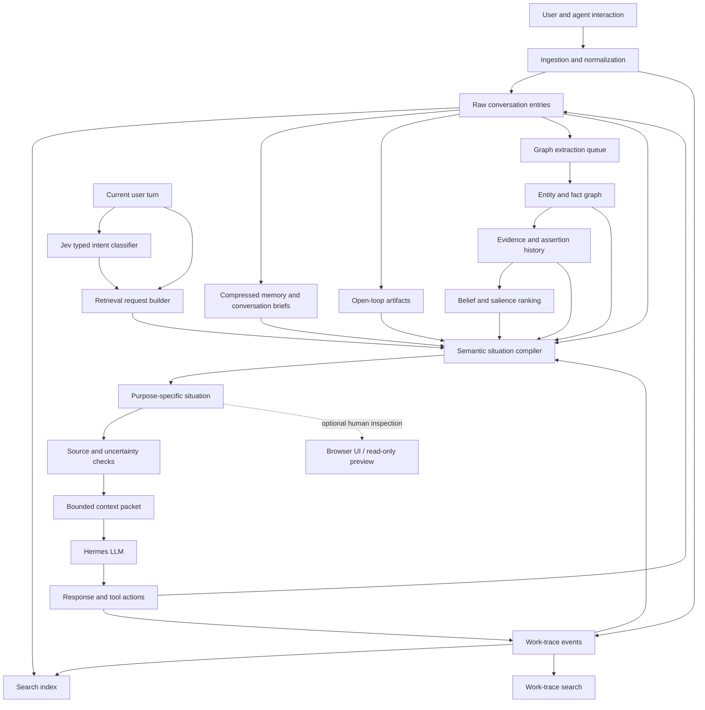
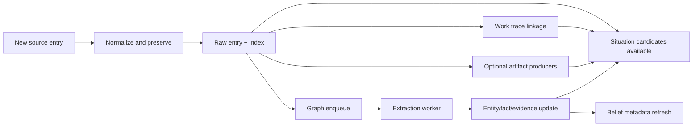

# Open Agent Diary — Future System Workflow

> **Status:** Design target, not current runtime behavior.
>
> This document describes how the system is intended to work when the semantic situation layer and Jev are mature and integrated. It is a model for understanding and reviewing the architecture, not a claim that every step is currently active.

## 1. The central idea

Open Agent Diary is not one memory database. It is a local-first evidence system with several derived views over an authoritative record.

The system should preserve three different kinds of truth:

1. **Conversation truth** — what the user and agent actually said.
2. **Execution truth** — what the agent actually did.
3. **Derived understanding** — what the system infers, organizes, ranks, or summarizes from the first two.

The most important rule is:

```text
Derived understanding may make evidence easier to find,
but it must never silently replace the evidence.
```

The finished system should therefore behave less like a collection of summaries and more like a small, inspectable semantic-memory engine:

```text
capture → preserve → derive → organize → retrieve → verify → respond
```

## 2. Future-state architecture at a glance



### Important interpretation

Jev is **not** a memory store, LLM provider, fallback model, or truth engine. In the target design it is a small typed sidecar that may help identify what kind of retrieval the current turn needs.

For example, Jev may classify a turn as:

```text
current_state
past_work_recall
decision_rationale
new_task
ordinary_conversation
ambiguous
```

That classification can influence which retrieval view is requested. It cannot write facts, answer the user, select the LLM, approve tools, or override evidence rules.

## 3. Layer-by-layer responsibilities

### Layer 1 — Raw conversation entries

**Purpose:** Preserve the authoritative conversation record.

Contains:

- user messages;
- assistant messages;
- imported transcripts;
- source platform and conversation identifiers;
- timestamps;
- author roles;
- explicit metadata.

Raw entries are immutable source material. They may be searched and fetched, but they should not be rewritten to contain later interpretations.

**This layer answers:**

```text
What was actually said?
When was it said?
Who said it?
Where did it come from?
```

### Layer 2 — Work trace

**Purpose:** Preserve meaningful execution activity that may not appear in the visible conversation.

Examples:

- files inspected;
- commands run;
- code changed;
- tests executed;
- deployments performed;
- blockers encountered;
- decisions and handoffs recorded.

Work trace is not hidden chain-of-thought. It is compact operational provenance.

**This layer answers:**

```text
What did the agent actually do?
What changed?
How was it verified?
What blocked progress?
```

### Layer 3 — Search and retrieval indexes

**Purpose:** Make raw entries and work traces quickly findable.

Indexes are performance aids, not additional truth. A search result is a pointer to evidence, not a final conclusion.

**This layer answers:**

```text
Where might the relevant evidence be?
```

### Layer 4 — Compressed memory and conversation briefs

**Purpose:** Reduce long historical conversations into retrieval-friendly summaries.

These are caches and navigation aids. They are useful for quickly locating an episode, but they may omit detail or preserve an outdated interpretation.

They should always retain:

- source entry IDs;
- time window;
- generation method and version;
- generated timestamp;
- clear derived status.

**This layer answers:**

```text
What is the rough shape of a long conversation?
Which source entries should be inspected next?
```

It should not be treated as a replacement for raw entries.

### Layer 5 — Open-loop artifacts

**Purpose:** Track unresolved concerns, commitments, questions, blockers, and pending decisions.

Open loops are especially valuable for “what should happen next?” retrieval. They are derived interpretations and must point to their supporting entries.

An open loop needs:

- status;
- summary;
- supporting entry IDs;
- first-seen and last-seen times;
- confidence or strength;
- closure evidence when resolved.

**This layer answers:**

```text
What remains unresolved?
What needs attention or review?
What is waiting on someone or something?
```

### Layer 6 — Knowledge graph

**Purpose:** Organize entities, relationships, facts, evidence, aliases, and corrections.

The graph is useful when the question is relational or state-based:

```text
What runs on this machine?
Which projects involve this service?
What is connected to this person?
What changed from the previous state?
```

Graph facts are extracted claims, not immutable truth. Each fact needs:

- source evidence;
- assertion history;
- provenance;
- confidence;
- temporal validity;
- correction or supersession information.

The graph must remain empty for a new user until real source data is processed. Empty is correct.

### Layer 7 — Belief and salience ranking

**Purpose:** Rank derived graph knowledge for deliberate inspection.

Ranking may consider:

- evidence strength;
- confidence;
- provenance;
- volatility;
- salience;
- useful corroboration;
- exposure debt and explicit usefulness signals.

Belief ranking is not a truth detector. It answers:

```text
Which derived facts are currently most worth inspecting?
```

In the target design, belief ranking should not be a separate competing memory stream. It should provide ranking signals to the semantic retrieval composer.

### Layer 8 — Semantic situation compiler

**Purpose:** Assemble a coherent, bounded view of an episode for one retrieval purpose.

This is the layer that turns distributed evidence into meaning without pretending that its interpretation is raw truth.

A situation can contain:

- topic and purpose;
- episode anchor;
- current state;
- historical/superseded state;
- decisions and rationale;
- open questions;
- supporting evidence;
- conflicts;
- inferred relationships;
- uncertainty and provenance.

The compiler should be generic. It must use structural signals such as:

- entities;
- timestamps;
- explicit source links;
- author and event roles;
- state and supersession fields;
- provenance;
- open-loop status;
- graph relationships.

It must not require our particular predicates, projects, or vocabulary.

**This layer answers:**

```text
What is the current situation, for this particular purpose?
```

## 4. The future retrieval workflow

### Step 1 — A new turn arrives

Hermes receives the user’s current message. The message itself remains the primary input to the LLM.

### Step 2 — Determine whether memory is needed

The retrieval request builder decides whether durable memory would materially help. Ordinary conversation should not automatically trigger a large memory search.

If the turn is ambiguous, the system should prefer a small, cautious retrieval or no retrieval rather than pretending to know the user’s intent.

### Step 3 — Jev optionally classifies retrieval intent

In the target design, Jev receives only a minimal, explicit payload such as the current message or a locally selected classification input. It returns a typed choice and confidence.

Example:

```text
choice: decision_rationale
confidence: 0.86
```

The result is advisory metadata. A low-confidence or failed Jev call must fall back safely to ordinary retrieval behavior.

Jev must not receive:

- the full Diary corpus;
- graph evidence;
- raw work traces;
- private historical memory;
- credentials;
- unrestricted tool payloads.

### Step 4 — Build a bounded retrieval request

The request builder selects:

- retrieval purpose;
- topic/entity anchors;
- time window if relevant;
- maximum candidates;
- character budget;
- required evidence types.

Examples:

```text
current_status:
  prioritize current state, recent changes, conflicts, and evidence

decision_rationale:
  prioritize decisions, reasons, rejected alternatives, and sources

next_action:
  prioritize open loops, blockers, review gates, and current state
```

### Step 5 — Gather candidate evidence

The composer gathers bounded candidates from:

- raw search;
- work-trace search;
- graph search;
- evidence history;
- open-loop artifacts;
- compressed memory/briefs;
- belief ranking signals.

These sources should not all produce independent final answers. They produce candidates for one semantic situation.

### Step 6 — Compile the situation

The compiler groups related evidence into an episode and separates:

```text
current state
history
decisions
open questions
conflicts
evidence
inferences
```

Every factual item carries source references. Any grouping or relationship inferred by the compiler is labelled as an inference.

### Step 7 — Apply temporal and truth checks

Before context is handed to Hermes:

- superseded facts are labelled historical;
- planned facts are not presented as current;
- retracted facts remain visible only when relevant to explain history;
- conflicting current values are shown together;
- provisional facts remain provisional;
- agent-derived narration is not silently promoted to user knowledge;
- unsupported claims are removed or marked uncertain.

### Step 8 — Render a small context packet

The final packet should be short, purpose-specific, and auditable:

```text
Situation: Service Cedar
Purpose: decision rationale

Current state:
- ... [raw_entry:abc]

Decision:
- ... [raw_entry:def]

Open question:
- ... [work_trace:ghi]

Caution:
- one source conflicts with the current state
```

The system should not inject every available layer into every turn. More memory is not automatically better memory.

### Step 9 — Hermes answers and acts

The Hermes LLM receives:

- the current user turn;
- the bounded situation packet;
- explicit provenance and uncertainty labels;
- normal system and tool instructions.

Hermes remains responsible for reasoning, explaining, deciding how to respond, and requesting tools. The semantic memory system supplies evidence and context; it does not answer on Hermes’s behalf.

### Step 10 — Record the outcome

After the turn:

- raw conversation is stored;
- meaningful execution is stored as work trace;
- derived artifacts may be refreshed asynchronously;
- evidence may update the graph;
- useful-memory feedback may update ranking signals.

A response being generated does not automatically make its claims user knowledge. Provenance and author role remain important.

## 5. Ingestion and maintenance workflow

The system’s background workflow should be:



The graph pipeline specifically remains:

```text
import → enqueue → extract → verify queue declines
```

A queue that only grows is a stalled pipeline, not successful learning.

Derived outputs should be recomputable. If a compiler, extractor, or ranking algorithm improves, the system should be able to regenerate its interpretation from preserved source data.

## 6. What each layer should not do

| Layer | Should do | Should not do |
|---|---|---|
| Raw entries | Preserve source truth | Accept later summaries as replacements |
| Work trace | Record meaningful execution | Store hidden chain-of-thought or every tiny observation |
| Search index | Find candidates quickly | Pretend search results are verified conclusions |
| Briefs/compressed memory | Navigate long history | Replace raw evidence |
| Open loops | Surface unresolved work | Invent concerns without sources |
| Graph | Represent relationships and evidence | Become an unquestionable truth store |
| Beliefs | Rank derived knowledge | Decide what is objectively true |
| Semantic compiler | Assemble purpose-specific situations | Create unsupported facts or global summaries |
| Jev | Classify retrieval intent | Answer, route models, call tools, or access the corpus |
| Hermes LLM | Reason and respond | Treat derived memory as unquestionable truth |

## 7. Efficiency and redundancy review

### Likely efficient structure

These layers have clearly different responsibilities and should remain:

1. raw entries;
2. work traces;
3. search indexes;
4. graph/evidence history;
5. semantic situation compiler;
6. Hermes integration boundary.

They solve different problems: preservation, execution provenance, finding, relationships, meaning, and response generation.

### Layers that should become inputs rather than competing memories

#### Compressed memory and conversation briefs

Keep them, but treat them as navigation caches. The semantic compiler should be able to use them when they save work, but it should not treat them as a separate authoritative memory stream.

#### Open loops

Keep the producer and artifacts, but make open loops an input to `next_action` situations rather than a separate answer path that competes with semantic retrieval.

#### Belief ranking

Keep the ranking machinery, but let it provide candidate ordering and salience signals to the situation compiler. Avoid injecting a separate global belief block alongside a situation block.

#### Jev

Keep Jev outside the memory graph. It should help select retrieval purpose, not create another semantic layer.

### Possible future simplification

The eventual retrieval surface could be reduced to one conceptual operation:

```text
retrieve_situation(topic, purpose, budget)
```

Internally it may use search, graph, work traces, beliefs, briefs, and open loops. Externally, Hermes should not need to understand every storage layer separately for ordinary recall.

Raw/evidence inspection remains available for verification and high-stakes claims.

## 8. Where the current design is still incomplete

The future workflow depends on capabilities that are only partly implemented:

- query-aware retrieval is not yet fully wired;
- the current belief layer is primarily salience-based, not question-aware;
- episodes and situation boundaries are inferred rather than persisted as durable objects;
- decision rationale is only reliable when source metadata or clear evidence exists;
- semantic previews have been tested locally but are not automatic Hermes context;
- Jev is still in shadow mode and has not earned authority;
- real-world quality and usefulness have not yet been measured over a long period;
- derived-layer freshness and invalidation need explicit operational monitoring.

These are not reasons to add more layers immediately. They are reasons to measure the existing workflow.

## 9. The measurements that matter

Before adding or removing a layer, measure:

### Retrieval quality

- Did the situation contain the information needed to answer?
- Were the right source records included?
- Were stale or superseded records labelled correctly?
- Were conflicts preserved?
- Were unsupported claims introduced?

### Efficiency

- candidates scanned;
- source records fetched;
- final context characters/tokens;
- retrieval latency;
- external model calls;
- extraction and classification cost;
- duplicate information across layers.

### Usefulness

- Did the context change or improve the answer?
- Did it prevent a wrong claim?
- Did it help resume an old project?
- Did the human or agent act on it?
- Was the same information repeatedly surfaced without helping?

### Maintenance health

- graph queue age and pending count;
- stale artifact age;
- source-reference resolution rate;
- percentage of provisional facts;
- conflict rate;
- failed extraction/retrieval rate;
- empty-state correctness for new users.

## 10. The design in one paragraph

A finished Open Agent Diary should preserve raw conversation and execution history locally, derive searchable summaries and relationship evidence without laundering them into truth, use Jev only as a small typed hint about what kind of retrieval is needed, compile bounded purpose-specific situations from all relevant layers, show provenance and uncertainty, and give Hermes a compact evidence packet rather than a pile of disconnected memories. Every derived layer should earn its place by improving retrieval quality, reducing cost or latency, or preserving a capability that another layer cannot provide.

That is the standard against which future additions—and possible removals—should be judged.
